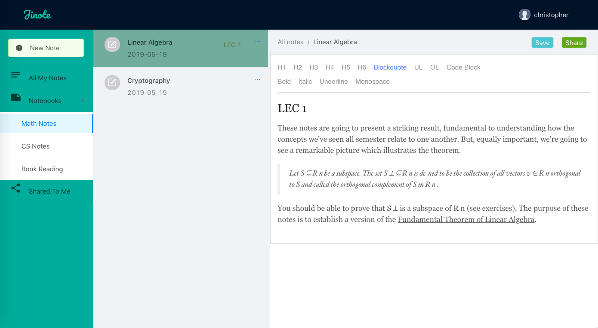

# jinote-react

jinote-react is a note application built with React and Redux(tools used: dva.js + umi.js).

**[Backend](https://github.com/christopherZhZ/jinote-server)** is another Spring Boot project.

Overview:

- User can create notebooks, and store notes to their accounts.
- Notes can be shared between users.

#### Run locally

- Clone this project and the **[Springboot backend](https://github.com/christopherZhZ/jinote-server)** to local machine.
- Run `mvn spring-boot:run` on root directory of backend.
- Run `npm install` and then `npm start` on root directory of frontend.
